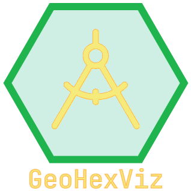

|travis| |ciconda| |cipip| |geohexvizver| |pythonver| |license|

Welcome to GeoHexViz!

Geospatial visualization is often used in military operations research to convey analyses to both analysts and decision makers.
For example, it has been used to help commanders coordinate units within a geographic region [feibush2000a]_, to depict how terrain impacts vehicle performance [laskey2010a]_, and inform training decisions in order to meet mission requirements [goodrich2019a]_.
When such analyses include a large amount of point-like data, combining geospatial visualization and binning -
in particular, hexagonal binning given its properties such as having the same number of neighbours as sides, the centre of each hexagon being equidistant from the centres of its neighbours, and that hexagons tile densely on curves surfaces [carr1992a]_ [sinha2019a]_ -
is an effective way to summarize and communicate the data.
Recent examples in the military and public safety domains include assessing the impact of infrastructure on Arctic operations [hunter2021a]_ and communicating the spatial distribution COVID-19 cases [shaito2021a]_ respectively.

However, creating such visualizations may be difficult for many since it requires in-depth knowledge of both Geographic Information Systems and analytical techniques, not to mention access to software that may require a paid license, training, and in some cases knowledge of a programming language such as Python or JavaScript. To help reduce these barriers, GeoHexViz - which produces publication-quality geospatial visualizations with hexagonal binning - is a Python package that provides a simple interface, requires minimal in-depth knowledge, and either limited or no programming. The result is an analyst being able to spend more time doing analysis and less time producing visualizations.

Example Usage
#############
GeoHexViz allows a user to generate hexagonally binned geospatial visualizations with two different methods.
Method 1 concerns using the GeoHexSimple package's script to run a file containing plot structure.
Method 2 concerns using Python code to interact with the functions within the package.
Method 2 method has two categories:

a) Using the functions that the GeoHexSimple script uses \
b) Using the PlotBuilder object from the GeoHexViz package

Please refer to the `examples directory <https://github.com/tony-zeidan/geohexviz/blob/master/examples>`_ for additional examples that go into great depth (for both methods).

Method 1 Example Usage
**********************

The GeoHexViz distribution includes a module that can allow the reading
of JSON files for quick and easy plots.

.. code-block:: json

    {
      "hexbin_layer": {
        "data": "<sample csv file>",
        "hex_resolution": 4
      },
      "output": {
        "filepath": "<sample filepath>",
        "width": 600,
        "height": 400
      },
      "display": true
    }

Running the JSON script will allow you to input a JSON file via command-line.
The GeoHexSimple command-line script was created using argparse and is very robust.
Running the help command provides the following:

.. code-block::

        >geohexsimple --help
        usage: geohexsimple [options]

        Input plot property files to make hexagonally binned plots.

        optional arguments:
          -h, --help            show this help message and exit
          -p PATH, --path PATH  path to json file or directory containing json files (required if no gui is used)
          -g, --gui             enable command-line gui (set to true if no path is provided)
          -nf, --nofeedback     turn off feedback while plotting
          -v, --verbose         whether to raise all errors or not

Running your plot properties file may look something like:

.. code-block::

    >geohexsimple --path <path to file>
    exit

Or something like:

.. code-block::

    >geohexsimple

    ✨=================GeoHexSimple================✨
     A script for the simple creation of
     hexagonally binned geospatial visualizations.
    ✨=============================================✨
    ✨Main Menu✨
    Please input the location of your parameterized
    builder file (JSON, YAML) or a directory containing
    builder files.
    Options: file path, help, exit.
    <path to file>

Method 2
********
As previously mentioned there are two ways to use the GeoHexViz library in Python code.
Method 2a concerns using the functions that the GeoHexSimple script uses to create plots from pre-existing plot parameter files.
Method 2b concerns using the functions from the GeoHexViz package to create plots.

Method 2a Example Usage
_______________________
You can use the functions that the GeoHexSimple script uses to create a plot from a pre-existing plot parameter file.
A simple example of this method is given below.

.. code:: python

    from geohexviz.utils.file import run_json

    run_json("<filepath here>")

Method 2b Example Usage
_______________________
You can use the functions and objects within GeoHexViz to create a plot from scratch.
A simple example of this method is given below.

.. code:: python

    from pandas import DataFrame
    from geohexviz.builder import PlotBuilder

    # Creating an example dataset
    inputdf = DataFrame(dict(
        latitude=[17.57, 17.57, 17.57, 19.98, 19.98, 46.75],
        longitude=[10.11, 10.11, 10.12, 50.55, 50.55, 31.17],
        value=[120, 120, 120, 400, 400, 700]
    ))

    # Instantiating builder
    builder = PlotBuilder()
    builder.set_hexbin(inputdf, hexbin_info=dict(binning_fn='sum', binning_field='value'))

    builder.finalize(raise_errors=False)
    builder.display(clear_figure=True)

    # A mapbox map
    builder.set_mapbox('<ACCESS TOKEN>')
    builder.finalize()
    builder.display(clear_figure=True)

Behind the Scenes
*****************
When the hexbin layer is set, the data is processed
in the following steps:

Data:

+-------+-------+-------+-------+
| index |  lats |  lons | value |
+=======+=======+=======+=======+
|   0   | 17.57 | 10.11 |  120  |
+-------+-------+-------+-------+
|   1   | 17.57 | 10.11 |  120  |
+-------+-------+-------+-------+
|   2   | 17.57 | 10.12 |  120  |
+-------+-------+-------+-------+
|   3   | 19.98 | 50.55 |  400  |
+-------+-------+-------+-------+
|   4   | 19.98 | 50.55 |  400  |
+-------+-------+-------+-------+
|   5   | 46.75 | 31.17 |  700  |
+-------+-------+-------+-------+

1) Coordinate columns are converted into geometry (if applicable)

+-------+-------+---------------------+
| index | value |       geometry      |
+=======+=======+=====================+
|   0   |  120  | POINT(17.57, 10.11) |
+-------+-------+---------------------+
|   1   |  120  | POINT(17.57, 10.11) |
+-------+-------+---------------------+
|   2   |  120  | POINT(17.57, 10.12) |
+-------+-------+---------------------+
|   3   |  400  | POINT(19.98, 50.55) |
+-------+-------+---------------------+
|   4   |  400  | POINT(19.98, 50.55) |
+-------+-------+---------------------+
|   5   |  700  | POINT(46.75, 31.17) |
+-------+-------+---------------------+

2) Hex cells are then placed over the data

+-----------------+-------+---------------------+
|       hex       | value |       geometry      |
+=================+=======+=====================+
| 83595afffffffff |  120  | POINT(17.57, 10.11) |
+-----------------+-------+---------------------+
| 83595afffffffff |  120  | POINT(17.57, 10.11) |
+-----------------+-------+---------------------+
| 83595afffffffff |  120  | POINT(17.57, 10.11) |
+-----------------+-------+---------------------+
| 835262fffffffff |  400  | POINT(19.98, 50.55) |
+-----------------+-------+---------------------+
| 835262fffffffff |  400  | POINT(19.98, 50.55) |
+-----------------+-------+---------------------+
| 831e5dfffffffff |  700  | POINT(46.75, 31.17) |
+-----------------+-------+---------------------+
(hex resolution = 3)

3) The data is grouped together by hex, and hex geometry is added

+-----------------+---------------+-------------+---------------------------------------------------+
|       hex       |     items     | value_field |                      geometry                     |
+=================+===============+=============+===================================================+
| 83595afffffffff | (120,120,120) |     360     | POLYGON ((30.57051 46.80615, 30.47843 46.19931... |
+-----------------+---------------+-------------+---------------------------------------------------+
| 835262fffffffff |   (400, 400)  |     800     | POLYGON ((49.90903 20.19437, 49.74835 19.60088... |
+-----------------+---------------+-------------+---------------------------------------------------+
| 831e5dfffffffff |     (700)     |     700     | POLYGON ((9.44614 17.39197, 9.49704 16.75205, ... |
+-----------------+---------------+-------------+---------------------------------------------------+
(binning function = sum of grouped values)

When the data is eventually plotted, a GeoJSON format of the data is
passed alongside plotly properties are passed to the Plotly graphing
library.

Installation
############

There are a few steps that a user must follow when installing GeoHexViz.
First, the user must install GeoPandas.
This is most easily done through the use of Anaconda, with this tool it can be installed like this:

.. code-block::

    conda install -c conda-forge geopandas

The version that GeoHexViz was developed with is version 0.8.1 (build py_0).
Next, the user must download or clone GeoHexViz's GitHub repository.
Finally, the user can navigate to the directory containing the ``setup.py`` file, and run:

.. code-block::

    python setup.py install

Or

.. code-block::

    pip install .

Note that to use the pdf cropping features, the user can do an editable install:

.. code-block::

    pip install -e .[pdf-crop]

The user may also install using pip and GitHub:

.. code-block::

    pip install git+https://github.com/tony-zeidan/geohexviz.git

Setting up a conda environment first helps.
To make this process smoother the ``environment.yml`` file is included, which includes all dependencies.
With this file, the first step (installation of GeoPandas) is done automatically.
Using this file an environment can be set up like this:

.. code-block::

    conda env create -f environment.yml

This will create an Anaconda environment called ``geohexviz`` on your machine,
simply activate the environment and run the ``setup.py`` file as shown above.

Further Documentation
#####################

The official documentation for GeoHexViz can be found at `this page <https://github.com/tony-zeidan/geohexviz/blob/master/docs>`_.
In particular, the API documentation for Python users can be found at `this page <https://github.com/tony-zeidan/geohexviz/blob/master/docs/api_reference-v1.0.0.pdf>`_.
The reference document published alongside this package can also be seen in the `docs directory <https://github.com/tony-zeidan/geohexviz/blob/master/docs>`_.

Limitations
###########

This package uses GeoJSON format to plot data sets. With GeoJSON comes
difficulties when geometries cross the 180th meridian . The issue
appears to cause a color that bleeds through the entire plot and leaves
a hexagon empty. In the final plot, this issue may or may not appear as
it only occurs at certain angles of rotation. In this package a simple
solution to the problem is implemented, in the future it would be best
to provide a more robust solution. The solution that is used works
generally, however, when hexagons containing either the north or south
pole are present, the solution to the 180th meridian issue persists.
This pole issue can be seen below.

There also exists some issues with the generation of discrete color
scales under rare circumstances. These circumstances include generating
discrete color scales with not enough hues to fill the scale, and
generating diverging discrete colorscales with the center hue in a weird
position. These issues have been noted and will be fixed in the near
future.

There exists issues with the positioning and height of the color bar
with respect to the plot area of the figure. Although the user is
capable of altering the dimensions and positioning of the color bar,
this should be done automatically as it is a common feature of
publication quality choropleth maps.

Contributing
############

For major changes, please open an issue first to discuss what you would like to change.
For more details please see `this page <https://github.com/tony-zeidan/geohexviz/blob/master/CONTRIBUTING.md>`_.

Acknowledgements
################

Thank you to Nicholi Shiell for his input in testing, and providing
advice for the development of this package.

Contact
#######

For any questions, feedback, bug reports, feature requests, etc please
first present your thoughts via GitHub issues. For further assistance
please contact tony.azp25@gmail.com.

README References
#################

.. [feibush2000a] Feibush, E., Gagvani, N., & Williams, D. (2000). Visualization for situational awareness. *IEEE Computer Graphics and Applications, 20* (5), 38–45. https://doi.org/10.1109/38.865878
.. [laskey2010a] Laskey, K. B., Wright, E. J., & da Costa, P. C. G. (2010). Envisioning uncertainty in geospatial information. *International Journal of Approximate Reasoning, 51* (2), 209–223. https://doi.org/10.1016/j.ijar.2009.05.011
.. [goodrich2019a] Goodrich, D. C., Heilman, P., Guertin, D., Levick, L. R., Burns, I., Armendariz, G., & Wei, H. (2019). *Automated geospatial watershed assessment (AGWA) to aid in sustaining military mission and training*. USDA-ARS Southwest Watershed Research Center (SWRC) Tucson United States. https://apps.dtic.mil/sti/citations/AD1092333
.. [carr1992a] Carr, D. B., Olsen, A. R., & White, D. (1992). Hexagon mosaic maps for display of univariate and bivariate geographical data. *Cartography and Geographic Information Systems, 19* (4), 228–236. https://doi.org/10.1559/152304092783721231
.. [sinha2019a] Sinha, A. (2019). *Spatial modelling tidbits: Honeycomb or fishnets?* Towards Data Science. https://towardsdatascience.com/spatial-modelling-tidbits-honeycomb-or-fishnets-7f0b19273aab
.. [hunter2021a] Hunter, G., Chan, J., & Rempel, M. (2021). *Assessing the impact of infrastructure on arctic operations* (Scientific Report DRDC-RDDC-2021-R024). Defence Research and Development Canada. https://cradpdf.drdc-rddc.gc.ca/PDFS/unc356/p812844_A1b.pdf
.. [shaito2021a] Shaito, M., & Elmasri, R. (2021). Map visualization using spatial and spatio-temporal data: Application to COVID-19 data. *The 14th Pervasive Technologies Related to Assistive Environments Conference*, 284--291. https://doi.org/10.1145/3453892.3461336

Copyright and License
#####################

Copyright (c) Her Majesty the Queen in Right of Canada, as represented
by the Minister of National Defence, 2021.

.. |travis| image:: https://app.travis-ci.com/tony-zeidan/GeoHexViz.svg?token=C7hNtodZZ6QrFPCe3ENK&branch=master
    :target: https://app.travis-ci.com/tony-zeidan/GeoHexViz
.. |ciconda| image:: https://github.com/tony-zeidan/geohexviz/actions/workflows/geohexviz-automated-tests-conda.yml/badge.svg
    :target: https://github.com/tony-zeidan/geohexviz/actions/workflows/geohexviz-automated-tests-conda.yml
.. |cipip| image:: https://github.com/tony-zeidan/geohexviz/actions/workflows/geohexviz-automated-tests-pip.yml/badge.svg
    :target: https://github.com/tony-zeidan/geohexviz/actions/workflows/geohexviz-automated-tests-pip.yml
.. |pythonver| image:: https://img.shields.io/badge/python-3.7,_3.8,_3.9-blue.svg
.. |geohexvizver| image:: https://img.shields.io/badge/geohexviz-v1.0.0-blue.svg
.. |license| image:: https://img.shields.io/badge/License-BSD%203.0-blue.svg
    :target: https://github.com/tony-zeidan/geohexviz/blob/master/LICENSE

