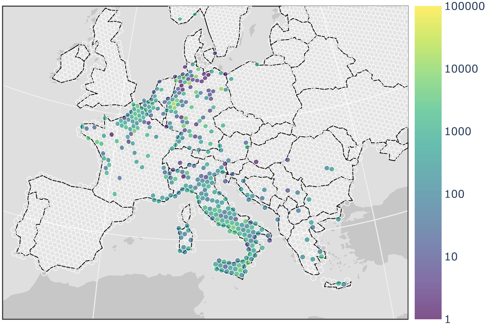

# Summary

Geospatial visualization is often used in military operations research to convey analyses to both analysts and decision makers. For example, it has been used to help commanders coordinate units within a geographic region [@feibush2000a], to depict how terrain impacts vehicle performance [@laskey2010a], and inform training decisions in order to meet mission requirements [@goodrich2019a]. When such analyses include a large amount of point-like data, combining geospatial visualization and binning &mdash; in particular, hexagonal binning given its properties such as having the same number of neighbours as sides, the centre of each hexagon being equidistant from the centres of its neighbours, and that hexagons tile densely on curved surfaces [@carr1992a; @sinha2019a] &mdash; is an effective way to summarize and communicate the data. Recent examples in the military and public safety domains include assessing the impact of infrastructure on Arctic operations [@hunter2021a] and communicating the spatial distribution of COVID-19 cases [@shaito2021a] respectively.

However, creating such visualizations may be difficult for many since it requires in-depth knowledge of both Geographic Information Systems and analytical techniques, not to mention access to software that may require a paid license, training, and in some cases knowledge of a programming language such as Python or JavaScript. To help reduce these barriers, GeoHexViz &mdash; which produces publication-quality geospatial visualizations with hexagonal binning &mdash; is a Python package that provides a simple interface, requires minimal in-depth knowledge, and either limited or no programming. The result is an analyst being able to spend more time doing analysis and less time producing visualizations.

GeoHexViz is accessible at `https://github.com/mrempel/geohexviz` and is installed via a `setup.py` script. In addition, a technical report describing the design and a set of detailed examples [@abouzeidan2021a] may be accessed at `https://cradpdf.drdc-rddc.gc.ca/PDFS/unc381/p814091_A1b.pdf`.

# Statement of need

Creating geospatial visualizations is often time-consuming and laborious [@vartak2014a]. For example, an analyst must make a variety of design decisions, including which map projection to use, the colour scheme, the basemap, and how to organize the data in layers. The resulting design may be implemented using one of many software packages, including:

+ **ArcGIS** [@dangermond2021a] which provides a wide range of capabilities, but requires a paid license and a solid foundation in geospatial information processing [@arcgis-limits]; 
+ **QGIS** [@qgis] which is free and open source, but like ArcGIS requires in-depth knowledge of geospatial information processing to be used effectively [@qgis-limits]; 
+ **D3** [@bostock2021a] which emphasizes web standards rather than a proprietary framework, but requires extensive knowledge of JavaScript; and 
+ **Plotly** [@plotly-web] which is a free and open source Python graphing library, but like D3 and other packages requires knowledge of a programming language. 

Common across these applications is the requirement to have knowledge of geospatial concepts, and acquiring this knowledge has been identified as a significant challenge [@sipe2003a; @rickles2017a]. In addition, the latter two options require programming. While many analysts have programming experience, not all do and in time-sensitive situations, as often encountered in a military setting, writing code to produce a visualization may not be feasible. With this in mind, GeoHexViz aims to reduce the time, in-depth knowledge, and programming required to produce publication-quality geospatial visualizations that use hexagonal binning. Implemented in Python, it seamlessly integrates several existing Python packages &mdash; Pandas, GeoPandas, Uber H3, Shapely, and Plotly &mdash; and extends their functionality to achieve these goals. Although originally designed for use within the military operations research community, it is expected that GeoHexViz may be of use in other communities as well.

# Features

In order to generate a publication-quality geospatial visualization, GeoHexViz requires an analyst to specify a set of *layers* &mdash; where each layer is defined as a "[group] of point, line, or area (polygon) features representing a particular class or type of real-world entities" [@layer-definition] &mdash; to be visualized. At a minimum, an analyst must specify one layer, the *hexbin layer*, through a set of required properties: first, a reference, such as the location of a CSV file, to the point-like data to be hexagonally binned; and second, references to the data containing the latitude, longitude, and value at each coordinate, e.g., columns names in the CSV file. If a value at each coordinate is not specified, a value of one is assumed by default, i.e., it is assumed there is one event per coordinate.
In addition, optional properties may be defined, such as the function to be applied to the values, i.e., `count`, `sum`, `max`, and the resolution of the hexagons (as defined by Uber H3). Default values for these optional properties are provided by GeoHexViz; for example, the default function applied is `sum`.

With this single layer, GeoHexViz generates a publication-quality visualization. However, if the visualization is not satisfactory, GeoHexViz enables an analyst to modify the visualization's properties. These properties may be categorized into two groups: first, those that use functionality provided by GeoHexViz that both integrates and extends its underlying libraries; and second, those that are passed directly to Plotly without modification. The first group of properties are: 

+ **scale**: the data displayed in the visualization may be on a linear (default) or logarithmic scale;
+ **colour scale**: the colour scale of the visualization may be continuous (default) or discrete;
+ **colour scale opacity**: the opacity of the colour scale may be set between opaque (default) to transparent;
+ **focus**: the visualization may have no focal point (default), showing a view of the whole Earth, or may be focused on one or more layers; and
+ **filter**: all the data may be present in the visualization (default) or may be clipped to a geographic region.

The second group includes a range of properties provided by Plotly, such as border colour, land colour, sea colour, figure size, etc. While default values for these are set by Plotly, many are overwritten by GeoHexViz in order to produce a publication-quality visualization out of the box.

Beyond the *hexbin layer*, an analyst may specify a variable number of optional layers, which include four types: *region*, *outline*, *point*, and *grid*. *Region* layers are plotted as filled polygons via Plotly Choropleth traces. *Outline* layers behave similarly to *region* layers; however, they are plotted as empty polygons via Plotly Scattergeo traces. *Point* layers enable an analyst to display additional point-like data, such as cities, on top of the *hexbin* layer. This layer is plotted via Plotly Scattergeo traces. In situations in which the data to be hexagonally binned does not cover the entire area of interest, *grid* layers, which are empty hexagons, may be specified to form a continuous grid of hexagons. Similar to the *hexbin* layer, each optional layer has its own set of properties, some of which are required in order to define the layer while others are optional with defaults provided.

GeoHexViz enables an analyst to create a visualization in two ways. First, an analyst may use GeoHexViz's command-line script `GeoHexSimple` to read a JSON file that specifies the layers. Second, an analyst may generate a visualization by writing Python code that imports GeoHexViz's Python module and invokes its functions. In either case, the data to be hexagonally binned may be provided in a variety of formats, including Shapefile and CSV. In addition, when using the Python script method the data may be provided as a DataFrame [@mckinney2021a] or GeoDataFrame [@jordahl2021a]. The visualization may be saved in a variety of formats, including PDF, PNG, JPEG, WEBP, SVG, and EPS formats.

# Example: Aerial bombings in World War 2

Allied aerial bombing in World War 2 occurred across a vast geographic region, with the focus shifting as the war progressed. In this example, a data set compiled by Lt Col Jenns Robertson of the United States Air Force and posted on Kaggle [@kaggle2021a] is used in conjunction with GeoHexViz to depict how this focus in Europe shifted over time. The `examples/ww2_bombings` directory in the GeoHexViz repository contains a JSON file `json_structure.json` that, in combination with a command-line script, creates a visualization for either 1943, 1944, or 1945 by setting the path to the corresponding CSV file. For example, the total mass of bombs dropped by Allied forces in 1943 is depicted in Figure 1. Similar visualizations for 1944 and 1945 are provided in the aforementioned directory, plus `json_walkthrough.md` which explains the contents of the JSON file. The directory also includes the corresponding Python code `python_walkthrough.py` that creates these visualizations, and a Jupyter Notebook `python_walkthrough.ipynb` that explains how the Python code creates the visualization.

# Limitations

GeoHexViz uses the GeoJSON format to plot data sets. With GeoJSON comes difficulties when geometries cross the 180th meridian; they may be interpreted as wrapping around the globe [@macwright2016a]. In GeoHexViz, hexagonal geometries are supplied via Uber H3 [@uber-H3], and as such this issue has been discussed with its developers [@uberh3-validhex-issue]. GeoHexViz provides a simple solution to address this problem; it tracks geometries that cross the meridian and shifts their coordinates making all of the coordinates either positive or negative as previously proposed [@macwright2016a]. However, it should be noted that when hexagons contain either the North or South Pole, the 180th meridian issue persists, resulting in what appears to be a colour bleeding throughout the visualization and leaving a hexagon (or hexagons) empty. 

A second issue is related to the positioning and height of the colour bar with respect to the plot area. When the dimensions of the plot area are not within a specific range of aspect ratios, the colour bar position and height may not be optimal. This issue has been raised with the Plotly development team [@plotly-colorbar-issue]. As this is an issue with Plotly itself, the library's developers have indicated that a calculation of plot area dimensions may be available in a future release which would address in this issue.

Lastly, GeoHexViz relies on the Python binding of the Uber H3 package in order to generate hexagons over polygons. This is done by passing the GeoJSON format of the polygon(s) to Uber H3. When the polygon size is large, grids may not generate properly resulting in no hexagons, or multiple invalid hexagons, being retrieved from Uber H3. Based on our experience, this issue does not seem to be widely discussed and a solution does not seem to exist at this time.

# Acknowledgements

Thank you to Nicholi Shiell for his input in testing, and providing advice for the development of this package and of its supporting documents.

# References